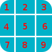

Nine-Patch
==========

Nine Patch is an image format that adds extra information into a normal image file to define which part of it should be scaled when the image is used in a size larger than its original size. The technique in using this format is also implemented in the core of the Android OS.

More information about this format can be found at:
http://developer.android.com/guide/topics/graphics/2d-graphics.html#nine-patch

It is very simple and flexible to make a stencil based on an existing bitmap image by defining the scaling part using the Nine-patch format. Starting from version 2.0, Pencil also provides built-in behaviours and tool to support this technique for developers to create their awesome collections. There are already many collections using this technique in Pencil repository such as the iOS UI Stencils.

Creating a simple stencil using Nine-patch
------------------------------------------

Suppose that we have the original rounded corner rectangle image as the following one and we want to create a shape base on this image and can be scaled to desired size while maintaining the corner radius.

1. Defining Nine-patch
^^^^^^^^^^^^^^^^^^^^^^

The first step is to create a Nine-patch from this image by adding 4 black lines to its border to define the scaling and padding areas (Please note that, the correct with of these lines must be 1 pixel. For the purpose of illustration, lines are enlarged in this tutorial).

.. image:: ../../images/Main_html_m2af8dc4a.png

In this nine-patch, top and left lines are used to divide the rectangle to nine pieces while bottom and right lines are used to define the bound.

2. Generating JS code
^^^^^^^^^^^^^^^^^^^^^

The next step is to use Pencil-provided tool to load this nine-patch image and generate JavaScript code containing the nine-patch data in a structure that is compatible with Pencil built-in implementation for nine-patch.

Go to Tools » Developer Tools » N-Path Script Generator... to launch the tool and load the image above. Code generated by this tool should be copied and used in the stencil. After parsing you can see that the images are sliced into 9 pieces:

These pieces are sliced based on the lines on the top and left side of the images:

The 1, 3, 7, 9 piece will be the same when scaling box.
The width of 2, 5, 8 piece will be scale based on the ratio between old width and new width.
The height of 4, 5, 6 piece will be scale based on the ratio between old height and new height.

3. Use the generated code in your stencil
^^^^^^^^^^^^^^^^^^^^^^^^^^^^^^^^^^^^^^^^^

The easiest way to use the generated code is to define a set of nine-patches in the collection level by using the 

Then in the code for the stencil that uses this nine-patch, you can simply use built-in supports of Pencil to simplify the code.

.. code-block:: xml

    <Shape id="sample" displayName="NPathSampe" icon="Icons/sample.png">
        <Properties>
            <PropertyGroup>
                <Property name="box" type="Dimension">320,44</Property>
            </PropertyGroup>

            <PropertyGroup name="Text">
                <Property name="text" displayName="Text" type="PlainText">Content</Property>
                <Property name="textFont" displayName="Default Font" type="Font">Helvetica|bold|normal|20px</Property>
            </PropertyGroup>
        </Properties>
        <Behaviors>
            <For ref="bg">
                <NPatchDomContent>
                    <Arg>collection.nPatches.sample</Arg>
                    <Arg>$box</Arg>
                </NPatchDomContent>
            </For>
            <For ref="text">
                <TextContent>$text</TextContent>
                $textFont
                <Fill>Color.fromString('#ffffffff')</Fill>
                <BoxFit>
                    <Arg>getNPatchBound(collection.nPatches.sample, $box)</Arg>
                    <Arg>new Alignment(1, 1)</Arg>
                </BoxFit>
            </For>
        </Behaviors>
        <p:Content xmlns="http://www.w3.org/2000/svg">
            <g id="bg"></g>
            <text id="text" />
        </p:Content>
    </Shape>

The NPatchDomContent behaviour bases on the provided nine-patch and dimension to perform calculation of scaling and then fill the bg element with images generated from the nine-patch.

The getNPatchBound utility function is used here to obtain the bound defined by the bottom-right markers in the nine-patch to place the text in the correct position.

.. image:: ../../images/Main_html_m1c0fecf0.png

4. More complex nine-patch
^^^^^^^^^^^^^^^^^^^^^^^^^^

Despite the name of the technique, nine-patch can be defined so that it sliced to an unlimited number of pieces depending on the nature of the shape we are creating. Suppose that we have the following bitmap and we would like to have it scale in a way that in the vertical direction, only blue and red parts are scaled while cyan area are remain unscaled and in the horizontal direction the whole length of the image should be scaled.

To do this, we can add the scaling markers to the images as in the following nine-patch:

.. image:: ../../images/Main_html_m58ebc780.png

If we do not add right and bottom lines, getNPatchBound will return the bound that containing the whole image.
